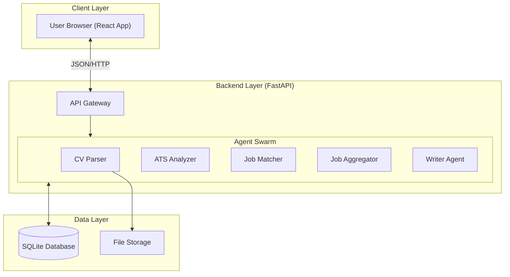
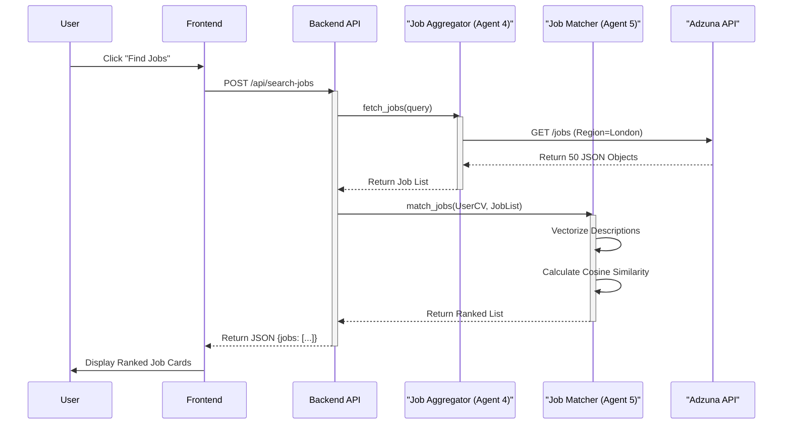
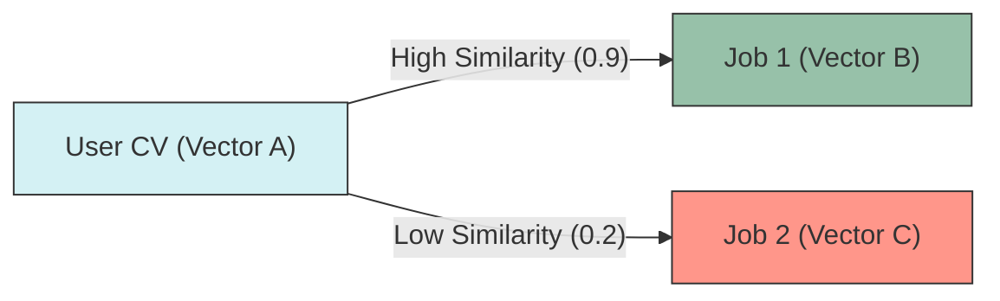

# Report Diagrams

## Diagram 1: High-Level System Architecture
*Caption: The three-tiered architecture of JobMatchAI, separating the User Experience (UX), Agentic Logic, and Data Persistence layers.*

---

## Diagram 2: Agent Interaction Sequence (The "Search" Flow)
*Caption: A sequence diagram illustrating the temporal flow of information when a user initiates a job search. Note the asynchronous parallel execution of the Search and Match agents.*

---

## Diagram 3: Matcher Logic Visualization
*Caption: Visualizing the Vector Space Model used by Agent 5. The User's CV Vector is compared to Job Vectors to find the smallest angle (Cosine Similarity).*

